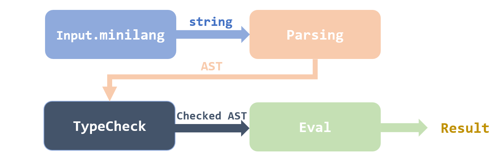
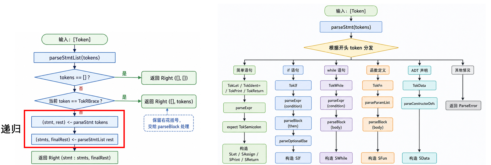
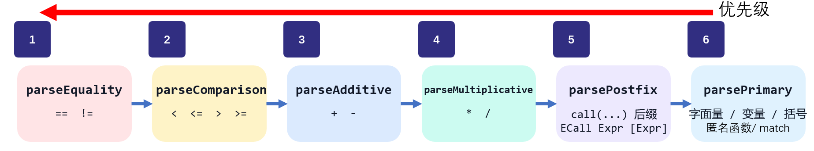
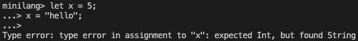
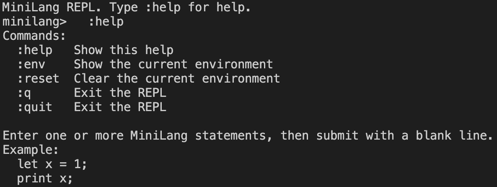
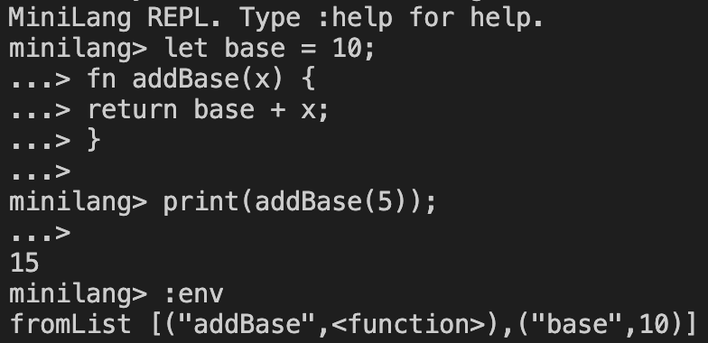

# MiniLang

- github项目地址：https://github.com/Maxwellqzh/MiniLang.git

MiniLang 是一个用 Haskell 实现的迷你语言解释器项目。当前代码已经从单纯的词法/语法分析扩展到完整的解释执行流程，并按功能拆成 `Parsing`、`TypeCheck` 和 `Backend` 三部分：

- `Parsing`：负责把源代码转换成 AST。
- `TypeCheck`：负责在执行前检查 AST 的静态类型。
- `Backend`：负责接收 AST，解释执行并输出结果。

当前完整流程：



## 项目分工


## 快速开始

编译项目：

```bash
cabal build exe:MiniLang
```

运行默认调试示例 `examples/showcase.minilang`：

```bash
cabal run exe:MiniLang
```

运行指定文件，先做类型检查，再输出程序中的 `print` 结果：

```bash
cabal run exe:MiniLang -- examples/showcase.minilang
```

输出 Source、Lexer、Parser、TypeCheck、Eval 和 Final Env：

```bash
cabal run exe:MiniLang -- --debug examples/showcase.minilang
```

只查看 Token：

```bash
cabal run exe:MiniLang -- --tokens examples/showcase.minilang
```

只查看 AST：

```bash
cabal run exe:MiniLang -- --ast examples/adt_match.minilang
```

启动交互式 REPL：

```bash
cabal run exe:MiniLang -- repl
```

REPL 会在多次输入之间持久维护运行时环境和类型环境。输入一段或多段 MiniLang 语句后，用空行提交执行；可用 `:env` 查看当前环境，`:reset` 清空环境，`:q` 或 `:quit` 退出。

运行测试：

```bash
cabal test
```

## 语言特点

MiniLang 当前的语言能力可以概括为：

- 基础表达与控制流能力：支持整数、浮点数、布尔值、字符串，以及 + - * / < <= > >= == != 等基础运算。支持变量定义、赋值、输出、if / else 分支和 while 循环。
- 函数式与递归能力：支持具名函数、匿名函数、函数调用、函数作为参数和返回值、高阶函数与闭包。具名函数在自身函数体内可见，因此可以直接实现递归调用 fact(n - 1)
- 数据建模能力：支持自定义 ADT 和表达式级模式匹配。
- 递归能力：具名函数在自身函数体内可见，因此可以直接实现递归调用，例如 `fact(n - 1)`。
- 静态类型检查能力：基于 Hindley-Milner 算法的类型推导。在执行前拦截一切类型不匹配与静默变型，保障运行安全。
- REPL交互式环境：提供独立命令行入口，跨输入周期持久维护“运行时环境”与“类型环境”，并提供绝对的执行容错。
- 工程辅助能力：支持 // 单行注释。提供底层 AST/Token 调试输出接口，并集成了基于 Haskell cabal 的自动化测试套件。

## 项目结构

```txt
app/
  Main.hs
  MiniLang/
    Repl.hs
    Parsing/
      Token.hs
      Lexer.hs
      Syntax.hs
      Parser.hs
    Backend/
      Value.hs
      Error.hs
      Eval.hs
    Typecheck/
      Type.hs
      Error.hs
      Checker.hs
examples/
  sample.minilang
  showcase.minilang
  higher_order.minilang
  higher_order_lambda.minilang
  float_literals.minilang
  adt_match.minilang
test/
  TestMain.hs
```

主要模块职责：

- `MiniLang.Parsing.Token`：定义词法单元 `Token`
- `MiniLang.Parsing.Lexer`：把源代码字符串转换成 `[Token]`
- `MiniLang.Parsing.Syntax`：定义 AST，包含 `Program`、`Stmt`、`Expr`、`Pattern`
- `MiniLang.Parsing.Parser`：把源码解析成 `Program`
- `MiniLang.Backend.Value`：定义运行时值 `Value` 和环境 `Env`
- `MiniLang.Backend.Error`：定义解释执行阶段的 `RuntimeError`
- `MiniLang.Backend.Eval`：解释执行 AST，入口是 `runProgram`
- `MiniLang.Typecheck.Type`：定义静态类型和类型环境
- `MiniLang.Typecheck.Error`：定义静态类型检查错误
- `MiniLang.Typecheck.Checker`：在执行前完成类型检查
- `Main.hs`：调试入口，串联 Lexer、Parser、TypeCheck 和 Eval
- `MiniLang.Repl`：交互式 REPL，支持跨输入持久维护运行时环境和类型环境
- `test/TestMain.hs`：自动化测试入口，覆盖本次补齐的 Backend 行为

## 语言设定

### 基础语句

```txt
let x = expr;
x = expr;
print expr;
if (expr) { ... } else { ... }
while (expr) { ... }
```

语义说明：

- `let x = expr;` 会把表达式结果绑定到当前环境，允许覆盖同名变量。
- `x = expr;` 要求变量已经存在，否则返回 `UndefinedVariable`。
- `print expr;` 会把值转换成文本并追加到输出列表。
- `if` 和 `while` 的条件必须是布尔值。
- `if` 和 `while` 不创建新的块级作用域，因此分支和循环里的赋值会更新当前环境。

### 函数、递归和闭包

具名函数定义：

```txt
fn add(a, b) {
  return a + b;
}
```

函数调用：

```txt
add(1, 2)
```

递归调用：

```txt
fn fact(n) {
  if (n == 0) {
    return 1;
  } else {
    return n * fact(n - 1);
  }
}
```

函数调用 AST 使用 `ECall Expr [Expr]`，被调用对象可以是任意表达式，而不只是函数名。因此语言可以自然表示：

```txt
fn makeAdder(base) {
  fn inner(value) {
    return base + value;
  }
  return inner;
}

let adder = makeAdder(10);
let closureResult = adder(5);
makeAdder(10)(5);
```

高阶函数和匿名函数：

```txt
fn applyTwice(f, x) {
  return f(f(x));
}

fn addOne(n) {
  return n + 1;
}

let result = applyTwice(addOne, 10);
```

匿名函数表达式使用 `fn(params) { ... }`：

```txt
let result = apply(fn(n) {
  return n + 1;
}, 10);
```

函数语义：

- 函数在运行时表示为闭包值，保存参数列表、函数体和定义时环境。
- 具名函数会在闭包环境中自绑定，因此支持递归。
- 匿名函数会按定义位置捕获环境，因此可以作为普通值传递和调用。
- 函数调用时使用“闭包环境 + 参数绑定”构造局部环境。
- 函数没有显式 `return` 时返回 `unit`。
- 顶层 `return` 会返回 `ReturnOutsideFunction`。

### ADT 和表达式级 match

Parser 和 Backend 支持自定义 ADT 声明：

```txt
data List {
  Nil;
  Cons(head, tail);
}
```

也支持表达式级 `match`：

```txt
fn sum(xs) {
  return match xs {
    Nil -> 0;
    Cons(head, tail) -> head + sum(tail);
  };
}
```

语法说明：

- `data TypeName { ... }` 是语句，用来声明一组构造器。
- 构造器可以没有字段，例如 `Nil;`。
- 构造器可以带字段名，例如 `Cons(head, tail);`。
- `match` 是表达式，可以放在 `return`、`let`、`print` 和函数参数等表达式位置。
- 每个分支格式为 `pattern -> expr;`。
- `_` 是通配符模式，匹配任意值但不绑定变量。
- 小写标识符模式会被解析为变量模式，例如 `x`。
- 大写开头标识符模式会被解析为构造器模式，例如 `Nil` 或 `Cons(head, tail)`。
- 当前 Parser MVP 暂不支持嵌套模式和字面量模式。

运行时语义：

- `data` 声明会把构造器注册到当前环境中。
- 零参数构造器会直接成为构造器值，例如 `Nil`。
- 带参数构造器会成为可调用的构造器函数，例如 `Cons(1, Nil)`。
- `match` 会按分支顺序尝试匹配，匹配成功后在分支表达式中绑定字段名。
- 没有任何分支匹配时返回 `MatchFailure`。

## Token 设计

关键字：

- `let`
- `data`
- `match`
- `fn`
- `return`
- `if`
- `else`
- `while`
- `print`
- `true`
- `false`

标识符和字面量：

- `TokIdent String`
- `TokInt Int`
- `TokFloat Double`
- `TokString String`

运算符：

- `+`
- `-`
- `->`
- `*`
- `/`
- `=`
- `==`
- `!=`
- `<`
- `>`
- `<=`
- `>=`

分隔符：

- `(`
- `)`
- `{`
- `}`
- `;`
- `,`
- `_`

## Lexer

`Lexer` 的目标是把源代码字符串转换成 `Token` 列表：

```haskell
lexProgram :: String -> Either LexError [Token]
```

成功时返回：

```haskell
Right [Token]
```

失败时返回：

```haskell
Left LexError
```

`lexProgram` 内部通过递归函数扫描输入，同时维护行号和列号：

```haskell
go :: Int -> Int -> String -> Either LexError [Token]
```

Lexer 负责：

1. 跳过空格、换行和 tab
2. 识别标识符和关键字
3. 读取整数、浮点数和字符串
4. 处理字符串转义和十六进制转义
5. 识别单字符和双字符运算符
6. 识别 `->` 作为 match 分支箭头
7. 跳过 `//` 单行注释
8. 在非法字符、非法转义、字符串未闭合等场景返回 `LexError`

## Parser

`Parser` 的目标是把源码解析成 AST：

```haskell
parseProgram :: String -> Either ParseError Program
```

内部流程：

```txt
source -> lexProgram -> [Token] -> parseTokens -> Program
```

Parser 使用递归下降方式。每个解析函数通常返回两个结果：

- 当前解析出的 AST 节点
- 尚未消费的 token

具体的实现包括两个递归框架：



### 程序和语句列表

整个程序是语句列表：

```haskell
newtype Program = Program [Stmt]
```

`parseStmtList` 会持续读取语句，直到 token 用完，或遇到右花括号 `TokRBrace`。

### 单条语句解析

当前支持的语句 AST：

```haskell
data ConstructorDef = ConstructorDef String [String]

data Stmt
  = SLet String Expr
  | SData String [ConstructorDef]
  | SFun String [String] [Stmt]
  | SReturn Expr
  | SAssign String Expr
  | SPrint Expr
  | SIf Expr [Stmt] [Stmt]
  | SWhile Expr [Stmt]
```

对应语法包括：

- `let x = expr;`
- `x = expr;`
- `print expr;`
- `if (expr) { ... } else { ... }`
- `while (expr) { ... }`
- `fn name(params) { ... }`
- `return expr;`
- `data Name { Constructor(...); }`

### 表达式优先级

表达式按以下优先级解析：

1. `==`、`!=`
2. `<`、`<=`、`>`、`>=`
3. `+`、`-`
4. `*`、`/`
5. 函数调用后缀
6. 整数、浮点数、布尔、字符串、变量、匿名函数、`match`、括号表达式



处理时，同一优先级的操作会在一个函数内执行，执行时会先执行更高一级的操作Parser函数，执行完成后再执行本级的匹配。

```haskell
parseEquality :: [Token] -> Either ParseError (Expr, [Token])
parseEquality tokens = do
  (lhs, rest) <- parseComparison tokens  --更高一级操作
  parseEqualityTail lhs rest             --本地操作
  where
    parseEqualityTail lhs tokens' =
      case tokens' of
        TokEq : rest -> do
          (rhs, rest1) <- parseComparison rest
          parseEqualityTail (EEq lhs rhs) rest1
        TokNeq : rest -> do
          (rhs, rest1) <- parseComparison rest
          parseEqualityTail (ENeq lhs rhs) rest1
        _ -> Right (lhs, tokens')
```

表达式 AST：

```haskell
data Expr
  = EInt Int
  | EFloat Double
  | EBool Bool
  | EString String
  | EVar String
  | EAdd Expr Expr
  | ESub Expr Expr
  | EMul Expr Expr
  | EDiv Expr Expr
  | ELt Expr Expr
  | ELe Expr Expr
  | EGt Expr Expr
  | EGe Expr Expr
  | EEq Expr Expr
  | ENeq Expr Expr
  | ECall Expr [Expr]
  | ELambda [String] [Stmt]
  | EMatch Expr [(Pattern, Expr)]
```

模式 AST：

```haskell
data Pattern
  = PWildcard
  | PVar String
  | PConstructor String [String]
```

### Parser 错误处理

Parser 会检测：

- 语句不完整
- 表达式不完整
- 缺少分号
- 缺少右括号
- 缺少右花括号
- 参数列表格式错误
- 实参列表格式错误
- data 构造器声明格式错误
- match 分支格式错误
- pattern 格式错误
- 尾部存在未消费 token

## TypeCheck

TypeCheck 位于 Parser 和 Backend 之间。Parser 负责把源码转换成 AST；TypeCheck 在 AST 进入 Backend 前先做静态检查；只有类型检查通过后，程序才会进入解释执行阶段。

核心入口是：

```haskell
typecheckProgram :: TypeEnv -> Program -> Either TypeError TypeEnv
```

`TypeEnv` 记录当前作用域里的变量、函数和构造器类型。文件运行时从 `emptyTypeEnv` 开始；REPL 则会把上一轮保存的类型环境传给下一轮，因此多次输入之间可以持续检查类型一致性。

当前实现借鉴了 Hindley-Milner 类型推断中的合一思想，但范围更小：它是一个面向 MiniLang AST 的单态、流敏感类型检查器。支持：

- `Int`、`Float`、`Bool`、`String`、`Unit`
- 函数类型和高阶函数
- `data` 构造器和 `match`
- `let` 的类型推断和赋值语句的类型一致性
- `if` / `while` 条件必须是 `Bool`
- 函数调用参数数量和参数类型检查
- `return` 只能出现在函数体内
- 函数体中所有返回路径的类型统一
- 数值运算和比较的静态约束

### 类型状态与替换表

类型推断过程中需要持续分配新的类型变量，并保存已经推导出的替换关系。实现中使用 `TCState` 显式维护这两部分状态：

```haskell
data TCState = TCState
  { tcNextVar :: Int
  , tcSubst :: Map.Map Int Type
  }
```

- `tcNextVar`：为新的未知类型分配唯一编号，例如 `t0`、`t1`。
- `tcSubst`：记录类型变量的替换关系，例如 `t0 = String`。

`TC` Monad 把“旧状态 -> 推导结果或错误 -> 新状态”的过程封装起来：

```haskell
newtype TC a = TC
  { runTC :: TCState -> Either TypeError (a, TCState)
  }
```

这样，检查 AST 节点时既可以更新替换表，也可以在发现类型错误时立即返回 `Left TypeError`。

### 合一算法

合一算法的目标是把“期望类型”和“实际类型”约束到同一个类型上。MiniLang 中对应的实现入口是：

```haskell
unifyWith :: String -> Type -> Type -> TC ()
```

第一个参数 `context` 用来生成更清晰的错误信息，例如 `"if condition"`、`"function argument"` 或 `"assignment to \"x\""`。后两个参数分别表示当前语境下的期望类型和实际推导出的类型。

合一前，算法会先调用 `resolveType` 把类型变量替换成当前已知的具体类型：

```haskell
expectedResolved <- resolveType expected
actualResolved <- resolveType actual
```

例如，替换表里已经有 `t1 = String` 时，`resolveType (TVar t1)` 会继续追踪并得到 `String`。这样可以避免在旧类型变量上重复推断，也能让后续错误信息显示更接近最终类型。

从实现角度看，合一不是一次简单的 `Eq` 比较，而是“解析类型变量、记录约束、递归检查结构”的过程。核心规则可以分成四类：

1. 变量绑定：如果任意一边是类型变量 `TVar var`，就尝试把它绑定到另一边的类型。
2. 基础类型：`Int`、`Float`、`Bool`、`String`、`Unit` 只有和自身合一时成功。
3. ADT 类型：`TData expectedName` 和 `TData actualName` 只有名称相同才成功。
4. 函数类型：`TFun expectedArgs expectedResult` 和 `TFun actualArgs actualResult` 会先检查参数数量，再递归合一每个参数，最后合一返回值。

对应代码结构是：

```haskell
case (expectedResolved, actualResolved) of
  (TVar var, ty) -> bindTypeVar var ty
  (ty, TVar var) -> bindTypeVar var ty
  (TInt, TInt) -> pure ()
  (TFloat, TFloat) -> pure ()
  (TBool, TBool) -> pure ()
  (TString, TString) -> pure ()
  (TUnit, TUnit) -> pure ()
  (TData expectedName, TData actualName)
    | expectedName == actualName -> pure ()
  (TFun expectedArgs expectedResult, TFun actualArgs actualResult) -> do
    checkArity expectedArgs actualArgs
    zipWithM_ (unifyWith context) expectedArgs actualArgs
    unifyWith context expectedResult actualResult
  _ -> throwTC (ExpectedType context expectedResolved actualResolved)
```

这段逻辑体现了两个关键点。第一，类型变量是可以继续被约束的未知量；第二，复杂类型必须按结构递归检查，不能只看最外层构造器。

类型变量绑定由 `bindTypeVar` 完成。它除了写入替换表，还会做 occurs check：

```haskell
if occursIn var ty
  then throwTC (InfiniteType var ty)
  else modifySubst (Map.insert var ty)
```

occurs check 用来防止无限类型。例如，不能把 `t0` 绑定成包含自身的函数类型 `t0 -> Int`。如果允许这种绑定，后续 `resolveType` 会无限展开。这里的失败会被表示成 `InfiniteType var ty`，说明检查器发现了无法构造的递归类型。

替换表的作用可以用一个小例子说明。假设推断过程中已经知道：

```txt
t0 = t1
t1 = String
```

那么再次解析 `t0` 时，`resolveType` 会顺着替换表继续应用替换，最终得到 `String`，而不是停在中间的 `t1`：

```haskell
applySubstType subst (TVar var) =
  case Map.lookup var subst of
    Nothing -> TVar var
    Just resolved -> applySubstType subst resolved
```

这也是每条语句检查完成后需要调用 `normalizeEnv` 的原因。`TypeEnv` 中可能暂时保存着 `t0`、`t1` 这样的未知类型；在把环境交给后续语句或 REPL 下一轮之前，需要尽量把它们解析成当前替换表下的最终类型。

函数类型是合一算法最能体现递归结构的地方。假设有两种类型：

```txt
期望类型：Fun [t1]     -> Int
实际类型：Fun [String] -> t2
```

`unifyWith` 会先确认两边都是函数类型，再执行两步：

1. 合一参数列表：`t1` 与 `String` 合一，得到 `t1 = String`。
2. 合一返回值：`Int` 与 `t2` 合一，得到 `t2 = Int`。

最终替换表增加：

```txt
t1 = String
t2 = Int
```

因此最终统一后的函数类型是：

```txt
Fun [String] -> Int
```

这个过程也解释了函数调用检查为什么可以同时完成“参数类型检查”和“返回值推断”。在 `inferCall` 中，如果被调用对象已经是函数类型：

```haskell
TFun paramTypes resultType -> do
  checkArity paramTypes argTypes
  zipWithM_ (unifyWith "function argument") paramTypes argTypes
  resolveType resultType
```

它会先检查参数数量，再把每个形参类型和实参类型合一，最后解析返回类型。只要任意一个实参无法和形参统一，就会在执行前报错。

数值运算也会产生类型约束。例如 `x + 1` 要求 `x` 是数值类型；`if (cond) { ... }` 会要求 `cond` 与 `Bool` 合一；两个分支都有 `return` 时，两个返回值类型也必须合一。也就是说，合一算法是 TypeCheck 中连接表达式推断、函数调用、控制流和赋值检查的核心机制。

### 赋值类型安全

赋值语句是类型检查中特别重要的一处。变量已经定义后，新的赋值不能悄悄改变它的类型：

```haskell
SAssign name expr -> do
  expectedType <- lookupType env name
  exprType <- inferExpr env expr
  unifyWith ("assignment to " ++ show name) expectedType exprType
  resolvedType <- resolveType expectedType
  resolvedEnv <- normalizeEnv env
  pure (continueWith (Map.insert name resolvedType resolvedEnv))
```

例如，`x` 已经被推断为 `Int` 后，再赋值为字符串会在执行前被拦截：



### 当前边界

当前实现是实用版静态检查器，不是完整的 Hindley-Milner 系统。暂不包含：

- let-polymorphism
- 泛型 ADT
- 模式匹配穷尽性检查
- 嵌套模式和字面量模式
- 独立的数值类型类；两个尚未约束的参数直接参与数值运算时，当前实现会默认推断为 `Int`

实现文件主要是：

- `app/MiniLang/Typecheck/Type.hs`
- `app/MiniLang/Typecheck/Error.hs`
- `app/MiniLang/Typecheck/Checker.hs`

## REPL

REPL 入口位于 `MiniLang.Repl`。启动命令：

```bash
cabal run exe:MiniLang -- repl
```

启动后输入 `:help` 可以查看当前支持的命令：



### 双环境状态

REPL 不只是重复调用解释器，还需要在多次输入之间保存状态。实现中使用 `ReplState` 同时维护运行时环境和类型环境：

```haskell
data ReplState = ReplState
  { replRuntimeEnv :: Env
  , replTypeEnv :: TypeEnv
  }
```

- `replRuntimeEnv`：保存实际运行时值，例如变量、函数闭包和构造器。
- `replTypeEnv`：保存对应的静态类型，供下一轮输入继续做类型检查。

每轮循环大致是：

1. 读取输入。空行提交当前块。
2. 调用 `parseProgram` 解析成 AST。
3. 用上一轮保存的 `replTypeEnv` 调 `typecheckProgram`。
4. 类型通过后，用上一轮保存的 `replRuntimeEnv` 调 `runProgramWithEnv`。
5. 只有执行成功时，才提交新的运行时环境和类型环境。
6. 解析失败、类型检查失败或运行时失败时，保留旧状态继续会话。

因此，REPL 可以跨多轮输入保留变量和函数：



截图中的 `base` 在第一轮输入后被保存在环境中；第二轮定义的 `addBase` 闭包可以继续引用它；后续调用 `addBase(5)` 得到 `15`。最后，`:env` 打印出当前环境中的变量和函数。

### 输入容错

REPL 对三类错误分别进行拦截：

- Parse 错误：源码不能构成合法 AST。
- TypeCheck 错误：AST 存在静态类型不匹配。
- Eval 错误：通过静态检查后，执行阶段仍然失败。

任意阶段失败时，REPL 都只打印错误，不提交本轮产生的新环境。下一次循环仍然使用之前保存的状态。这样，一次错误输入不会破坏已经定义好的变量和函数。

### REPL 命令

支持的命令有：

- `:help`：显示帮助。
- `:env`：打印当前运行时环境。
- `:reset`：同时清空运行时环境和类型环境。
- `:q`：退出 REPL。
- `:quit`：退出 REPL。

`:` 命令只在当前输入块为空时识别。源码可以单行输入，也可以多行输入；空行表示提交当前输入块。

## Backend

Backend 的核心入口：

```haskell
runProgram :: Program -> Either RuntimeError (Output, Env)
```

也就是说，Backend 的输入是 Parser 产生的 AST，输出是：

- `Output`：程序中所有 `print` 产生的文本列表
- `Env`：程序结束后的最终运行时环境
- `RuntimeError`：解释执行阶段发生的错误

### Backend 执行入口

Backend 的入口分为两层：

```haskell
runProgram :: Program -> Either RuntimeError (Output, Env)
runProgramWithEnv :: Env -> Program -> Either RuntimeError (Output, Env)
```

`runProgram` 是普通文件执行入口，它从空运行时环境开始执行；`runProgramWithEnv` 接收一个已有 `Env`，因此可以被 REPL 复用，让多轮输入之间共享变量、函数和构造器。

核心流程可以概括为：

```txt
Program [Stmt]
  -> execBlock False initialEnv [] stmts
  -> Either RuntimeError (Output, Env)
```

这里的 `False` 表示顶层程序不允许直接使用 `return`。如果顶层语句触发了 `Returned`，`runProgramWithEnv` 会把它转换成 `ReturnOutsideFunction`，避免把函数内部控制流泄露到程序顶层。

### 运行时值

```haskell
type Env = Map.Map String Value

data Value
  = VInt Int
  | VFloat Double
  | VBool Bool
  | VString String
  | VUnit
  | VFunction [String] [Stmt] Env
  | VConstructor String [Value]
  | VConstructorFunction String Int
```

说明：

- `Env` 是运行时环境，保存变量名、函数名和构造器名到 `Value` 的映射。
- `VInt`、`VFloat`、`VBool`、`VString` 分别表示整数、浮点数、布尔值和字符串。
- `VUnit` 表示没有显式返回值。
- `VFunction` 表示函数闭包，保存参数、函数体和定义时环境。
- `VConstructor` 表示已经构造出来的 ADT 值，例如 `Nil` 或 `Cons(1, Nil)`。
- `VConstructorFunction` 表示 `data` 声明注册出来的带参数构造器。
- 函数值显示为 `<function>`，避免递归打印闭包环境。
- 构造器函数显示为 `<constructor Name>`。
- 普通相等比较不允许比较函数值；整数和浮点数可以进行混合数值运算与比较。

### 执行控制流

Backend 内部使用执行信号区分普通执行和函数返回：

```haskell
data ExecSignal
  = Continue
  | Returned Value
```

`return` 不是普通值绑定，而是控制流信号。这个信号会从嵌套的 `if`、`while` 和语句块中向外传播，直到函数调用边界被消费。

语句块执行函数是：

```haskell
execBlock :: Bool -> Env -> Output -> [Stmt] -> Either RuntimeError (ExecSignal, Env, Output)
```

`execBlock` 按顺序递归消费语句列表。每执行一条语句，都会得到新的 `Env`、新的 `Output` 和一个 `ExecSignal`：

- 如果信号是 `Continue`，继续执行剩余语句。
- 如果信号是 `Returned value`，立即停止当前语句块，并把返回信号向外传递。
- 如果语句列表为空，返回 `Continue`、当前环境和当前输出。

这种设计让 `return` 可以自然穿过 `if`、`while` 和函数体中的局部语句块，同时又不会被误写入环境。

### 语句解释执行

语句执行入口是：

```haskell
execStmt :: Bool -> Env -> Output -> Stmt -> Either RuntimeError (ExecSignal, Env, Output)
```

不同语句对运行时状态的影响不同：

- `SLet name expr`：先调用 `evalExpr` 得到表达式值，再用 `Map.insert name value env` 写入环境。
- `SAssign name expr`：先检查变量是否已经存在；如果存在，求值后覆盖旧绑定；如果不存在，返回 `UndefinedVariable`。
- `SFun name params body`：构造 `VFunction params body recursiveEnv`，并把函数名写入 `recursiveEnv`，因此具名函数可以递归引用自身。
- `SReturn expr`：只有 `allowReturn` 为 `True` 时才允许执行；否则返回 `ReturnOutsideFunction`。
- `SPrint expr`：求出表达式值后，通过 `renderValue` 转成字符串，并追加到 `Output`。
- `SIf cond thenBranch elseBranch`：先求条件表达式；只有 `VBool True` 和 `VBool False` 是合法条件，其他值会产生 `TypeMismatch`。
- `SWhile cond body`：循环求条件表达式。条件为 `VBool True` 时执行循环体，条件为 `VBool False` 时结束循环。
- `SData _ constructors`：调用 `registerConstructors`，把 ADT 构造器注册到运行时环境中。

因此，`execStmt` 的职责不是直接“打印”或“返回最终结果”，而是让每条语句推动 `Env`、`Output` 或 `ExecSignal` 前进。

### 表达式解释执行

表达式求值入口是：

```haskell
evalExpr :: Env -> Output -> Expr -> Either RuntimeError (Value, Output)
```

表达式求值的结果是一个运行时 `Value`，同时保留最新的 `Output`。这是因为表达式内部可能包含函数调用，而函数调用内部可能执行 `print`。

主要分支包括：

- `EInt`、`EFloat`、`EBool`、`EString`：直接包装为对应的运行时值。
- `EVar name`：从 `Env` 中查找变量；找不到时返回 `UndefinedVariable`。
- `EAdd`、`ESub`、`EMul`：进入 `evalIntBinary`。
- `EDiv`：进入 `evalDiv`，额外处理除零。
- `ELt`、`ELe`、`EGt`、`EGe`：进入 `evalIntComparison`，返回布尔值。
- `EEq`、`ENeq`：进入 `evalEquality`。
- `ELambda params body`：返回 `VFunction params body env`，捕获定义时环境。
- `EMatch scrutinee branches`：先求 `scrutinee`，再调用 `evalMatch` 选择分支。

函数调用有一个特殊分支：

```haskell
ECall (EVar name) args -> ...
ECall callee args -> ...
```

当被调用对象是变量名时，Backend 会先直接查 `Env`。如果没有找到，并且名字以大写字母开头，就返回 `UnknownConstructor`；如果是普通变量名，则返回 `UndefinedVariable`。当被调用对象是任意表达式时，Backend 会先求出 `calleeValue`，再求参数列表，最后统一交给 `callValue` 分派。

### 函数、闭包与调用分派

函数运行时值是：

```haskell
VFunction [String] [Stmt] Env
```

它保存三部分信息：

- 参数名列表
- 函数体语句列表
- 定义函数时捕获到的环境

匿名函数 `ELambda` 会直接把当前 `env` 捕获进 `VFunction`。具名函数 `SFun` 则使用递归环境：

```haskell
let closure = VFunction params body recursiveEnv
    recursiveEnv = Map.insert name closure env
```

由于 `closure` 内部保存的是 `recursiveEnv`，函数体里可以再次通过函数名找到自己，因此 MiniLang 可以直接支持递归函数。

实际调用由 `callValue` 统一处理：

```haskell
callValue :: Value -> [Value] -> Output -> Either RuntimeError (Value, Output)
```

当 `callee` 是 `VFunction params body closureEnv` 时，Backend 会先检查参数数量。如果数量匹配，就构造局部环境：

```haskell
localEnv = Map.fromList (zip params args) `Map.union` closureEnv
```

`Map.union` 左侧优先，因此参数绑定会覆盖闭包环境中的同名变量。随后函数体通过 `execBlock True localEnv output body` 执行。这里的 `True` 表示函数体内允许 `return`：

- 如果函数体返回 `Returned value`，函数调用结果就是这个 `value`。
- 如果函数体执行完仍是 `Continue`，函数默认返回 `VUnit`。

当 `callee` 是 `VConstructorFunction` 时，`callValue` 会走构造器调用分支；当 `callee` 是其他值时，返回 `NotCallable`。

### 数值运算与相等比较

MiniLang 同时支持整数和浮点数，因此 Backend 把数值运算拆成几个辅助函数：

```haskell
evalIntBinary :: String -> (Int -> Int -> Int) -> (Double -> Double -> Double) -> Env -> Output -> Expr -> Expr -> Either RuntimeError (Value, Output)
evalDiv :: Env -> Output -> Expr -> Expr -> Either RuntimeError (Value, Output)
evalIntComparison :: String -> (Double -> Double -> Bool) -> Env -> Output -> Expr -> Expr -> Either RuntimeError (Value, Output)
evalEquality :: Bool -> Env -> Output -> Expr -> Expr -> Either RuntimeError (Value, Output)
```

`evalIntBinary` 用于 `+`、`-` 和 `*`：

- 如果左右值都是 `VInt`，结果保持为 `VInt`。
- 如果存在 `VFloat`，或者整数需要参与混合运算，则通过 `toDouble` 转成浮点数，结果为 `VFloat`。
- 如果任一操作数不是数值，返回 `TypeMismatch`。

`evalDiv` 单独处理除法，因为它需要检查除零：

- `VInt _ / VInt 0` 返回 `DivisionByZero`。
- 浮点除法中，如果右侧转换后是 `0.0`，也返回 `DivisionByZero`。
- 两个整数相除使用整数 `div`，混合数值除法返回 `VFloat`。

`evalIntComparison` 用于 `<`、`<=`、`>` 和 `>=`。它会把左右操作数转换为数值后比较，并返回 `VBool`。

`evalEquality` 用于 `==` 和 `!=`。函数值和构造器函数不能比较；其他值会先尝试数值相等比较，如果不是数值，再使用 `Value` 的结构相等。

### ADT 构造器注册与调用

`data` 声明在 Backend 中不会立即生成具体数据，而是把构造器入口写入 `Env`：

```haskell
registerConstructors :: [ConstructorDef] -> Env -> Env
```

注册规则是：

- 零字段构造器注册为 `VConstructor name []`，例如 `Nil`。
- 带字段构造器注册为 `VConstructorFunction name arity`，例如 `Cons(head, tail)` 会注册为 `VConstructorFunction "Cons" 2`。

因此：

```minilang
data List { Nil; Cons(head, tail); }
```

在运行时会把 `Nil` 和 `Cons` 都写入环境，但二者含义不同：`Nil` 已经是一个完整的 ADT 值，而 `Cons` 是等待参数的构造器函数。

构造器调用和普通函数调用一样使用 `ECall` 表示，最终都进入 `callValue`。当被调用值是 `VConstructorFunction name arity` 时，Backend 会检查参数数量：

```haskell
if length args == arity
  then Right (VConstructor name args, output)
  else Left (ConstructorArityMismatch name arity (length args))
```

也就是说，`Cons(1, Nil)` 最终会生成类似下面的运行时值：

```haskell
VConstructor "Cons" [VInt 1, VConstructor "Nil" []]
```

### match 模式匹配

`match` 表达式首先求被匹配值，然后按分支顺序尝试匹配：

```haskell
evalMatch :: Env -> Output -> Value -> [(Pattern, Expr)] -> Either RuntimeError (Value, Output)
matchPattern :: Pattern -> Value -> Either RuntimeError (Maybe Env)
```

`matchPattern` 的返回值有三种含义：

- `Right Nothing`：当前分支不匹配，继续尝试下一个分支。
- `Right (Just bindings)`：当前分支匹配成功，并产生字段绑定。
- `Left (InvalidPattern message)`：构造器名称匹配，但 pattern 字段数量不正确。

支持的 pattern 包括：

- `_`：通配符，匹配任意值，不产生绑定。
- `PVar name`：变量模式，匹配任意值，并把整个值绑定到 `name`。
- `PConstructor name fields`：构造器模式，要求被匹配值是同名 `VConstructor`。

当构造器模式匹配成功时，Backend 使用字段名和构造器值中的字段值建立绑定：

```haskell
Map.fromList (zip fields values)
```

随后分支表达式会在扩展环境中求值：

```haskell
evalExpr (bindings `Map.union` env) output expr
```

这里 `bindings` 放在 `Map.union` 左侧，因此 pattern 绑定会优先于外层环境中的同名变量。若所有分支都不匹配，`evalMatch` 返回 `MatchFailure`。

### 输出渲染与错误传播

`Output` 的类型是字符串列表。`SPrint` 不直接执行 IO，而是把渲染后的文本追加到 `Output`：

```haskell
Right (Continue, env, nextOutput ++ [renderValue value])
```

最后由 `Main` 或 REPL 负责把 `Output` 打印到终端。这样可以让解释器核心保持纯函数风格，也便于测试直接断言输出列表。

错误统一通过 `Either RuntimeError` 的 `Left` 分支向上传播。只要某一步求值失败，后续执行就会停止，错误交给 `Main` 或 REPL 展示。

### 运行时错误

当前运行时错误包括：

```haskell
data RuntimeError
  = UndefinedVariable String
  | TypeMismatch String
  | DivisionByZero
  | ArityMismatch Int Int
  | ConstructorArityMismatch String Int Int
  | UnknownConstructor String
  | NotCallable String
  | MatchFailure
  | InvalidPattern String
  | ReturnOutsideFunction
```

典型场景：

- 读取未定义变量：`UndefinedVariable`
- 对不支持的类型做算术、比较或控制流判断：`TypeMismatch`
- 除以零：`DivisionByZero`
- 函数参数数量不匹配：`ArityMismatch`
- 构造器参数数量不匹配：`ConstructorArityMismatch`
- 调用未知大写构造器：`UnknownConstructor`
- 调用非函数/非构造器函数值：`NotCallable`
- `match` 没有任何分支匹配：`MatchFailure`
- 构造器 pattern 字段数量不合法：`InvalidPattern`
- 顶层使用 `return`：`ReturnOutsideFunction`

### Backend 与 TypeCheck / REPL 的关系

当前 main 分支中，文件执行流程已经把 TypeCheck 放在 Backend 之前。也就是说，`Main.hs` 会先调用 `parseProgram` 得到 AST，再调用 `typecheckProgram emptyTypeEnv program` 做静态检查；只有类型检查通过后，才会进入 `runProgram`。

REPL 中的流程类似，但它会维护两份状态：

- `replTypeEnv`：传给 `typecheckProgram`，保证多轮输入之间类型一致。
- `replRuntimeEnv`：传给 `runProgramWithEnv`，保证多轮输入之间运行时值可见。

因此，Backend 负责的是“已经通过语法解析和类型检查之后”的解释执行。但它仍然保留完整的 `RuntimeError`，因为运行时仍可能出现静态阶段无法完全消除的情况，例如除零、运行时不可调用值、match 无匹配分支等。

## 示例输入

综合示例文件位于：

```txt
examples/showcase.minilang
```

示例覆盖：

- 变量声明和算术
- 布尔值和字符串转义
- 函数定义和调用
- 递归 factorial
- 闭包式 `makeAdder`
- 比较和相等运算
- `while` 循环
- `if / else` 控制流

额外示例：

- `examples/higher_order.minilang`：高阶函数
- `examples/higher_order_lambda.minilang`：匿名函数表达式
- `examples/float_literals.minilang`：浮点数字面量和浮点运算
- `examples/adt_match.minilang`：ADT 和表达式级 match

节选：

```txt
fn fact(n) {
  if (n == 0) {
    return 1;
  } else {
    return n * fact(n - 1);
  }
}

fn makeAdder(base) {
  fn inner(value) {
    return base + value;
  }
  return inner;
}

let adder = makeAdder(10);
let closureResult = adder(5);
let factorial = fact(5);
```

运行后，最终环境中会包含：

```txt
closureResult = 15
factorial = 120
```

## 测试覆盖

`test/TestMain.hs` 覆盖了本次补齐的主要 Backend 行为：

- 匿名函数求值和调用。
- 浮点输出、浮点运算、整型/浮点混合运算。
- 浮点比较和整型/浮点相等比较。
- ADT 构造器生成运行时值。
- `match` 递归求和。
- `_` 通配符 fallback。
- 构造器参数数量错误。
- 未知构造器错误。
- `match` 无匹配分支错误。

## 调试 Backend

可以在 GHCi 中直接构造 AST 并传给 `runProgram`：

```haskell
import MiniLang.Parsing.Syntax
import MiniLang.Backend.Eval

runProgram (Program [SLet "x" (EInt 1), SPrint (EVar "x")])
```

预期返回：

```haskell
Right (["1"], fromList [("x",1)])
```

也可以测试错误路径：

```haskell
runProgram (Program [SPrint (EVar "missing")])
```

预期返回：

```haskell
Left (UndefinedVariable "missing")
```

## 当前状态和后续方向

当前项目已经形成清晰的前后端结构：

- Parsing 层负责源码到 AST。
- TypeCheck 层负责执行前的静态类型检查。
- Repl 层负责提供交互式命令行。
- Backend 层负责 AST 到执行结果。
- Main 层负责把三部分串起来做调试运行。
- Test 层负责覆盖关键解释执行路径。

后续可以继续补充：

- 更完整的错误位置信息
- 更完整的类型系统，例如 let-polymorphism、泛型 ADT、模式穷尽性检查和错误位置信息
- 嵌套模式和字面量模式
- 更多标准库函数
- 更细粒度的 CLI/REPL 自动化测试
